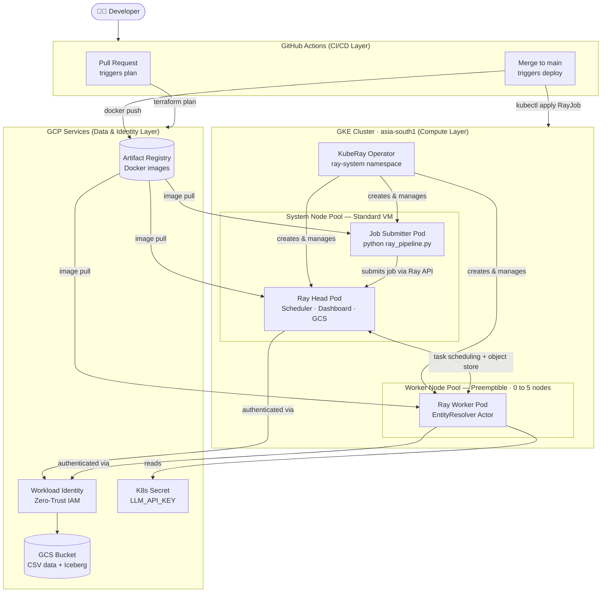
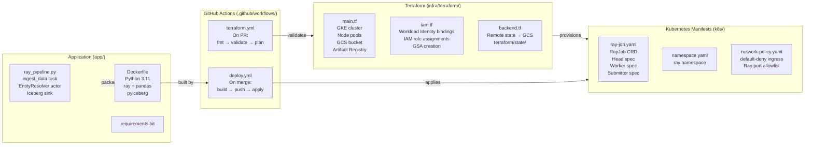
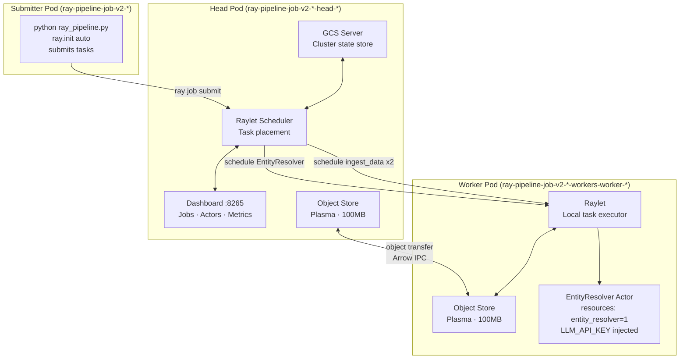
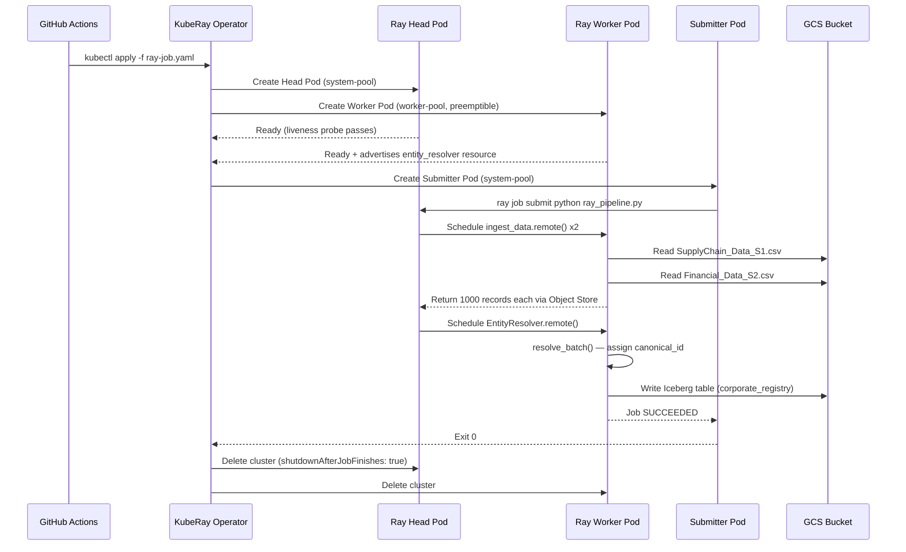
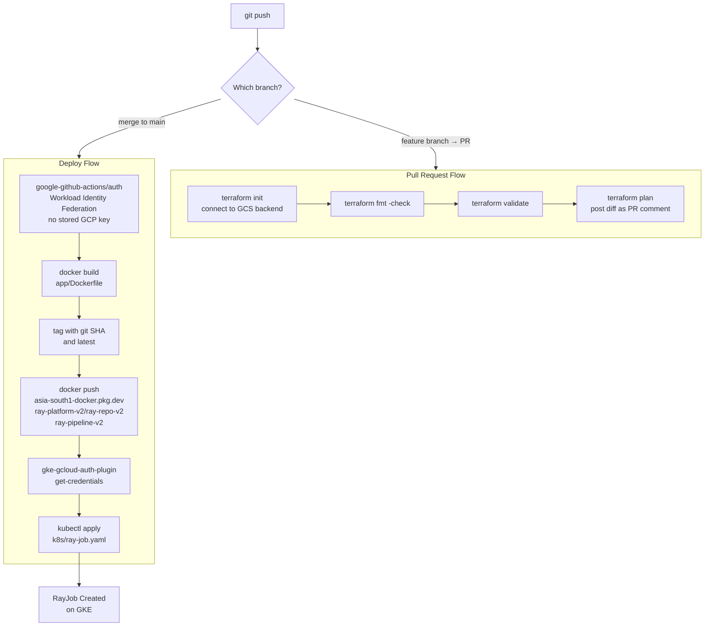
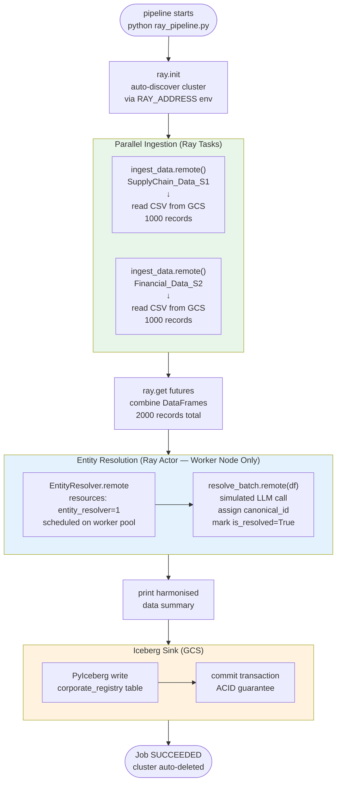
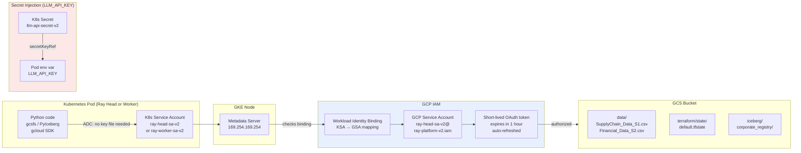

<div align="center">

<h1>Ray AI Platform v2</h1>

<p>
  A production-grade distributed AI pipeline running on Google Kubernetes Engine, provisioned<br/>
  entirely with Terraform, secured via Zero-Trust Workload Identity, and deployed through GitHub Actions.
</p>

[](https://github.com/YOUR_USERNAME/ray-platform-v2/actions)
[](https://www.terraform.io/)
[](https://ray-project.github.io/kuberay/)
[](https://ray.io/)
[](https://cloud.google.com/kubernetes-engine)
[](LICENSE)

</div>

---

## What This Project Does

This platform automates the full lifecycle of a **distributed data pipeline** on Kubernetes:

1. **Ingest** two corporate datasets (Supply Chain + Financial) in parallel from GCS
2. **Resolve** duplicate company entries using an LLM-backed entity resolution actor
3. **Commit** the harmonised, canonical dataset to an Apache Iceberg table on GCS
4. **Tear down** the Ray cluster automatically after the job completes — saving cost

Every step is automated: a `git push` triggers infrastructure validation, container build, and job execution — no manual steps after the first setup.

---

## Table of Contents

- [High-Level Design (HLD)](#high-level-design-hld)
- [Low-Level Design (LLD)](#low-level-design-lld)
- [CI/CD Flow](#cicd-flow)
- [Pipeline Execution Flow](#pipeline-execution-flow)
- [Security & Identity Flow](#security--identity-flow)
- [Infrastructure](#infrastructure)
- [Project Structure](#project-structure)
- [Prerequisites](#prerequisites)
- [Quick Start](#quick-start)
- [Configuration Reference](#configuration-reference)
- [Spot Instance Strategy](#spot-instance-strategy)
- [Ray Data & Ray Train at Scale](#ray-data--ray-train-at-scale)
- [Observability](#observability)
- [Node Failure & Recovery](#node-failure--recovery)

---

## High-Level Design (HLD)

The system has four distinct layers that interact in sequence — Developer → CI/CD → Kubernetes → GCP Services.



### HLD Summary

| Layer | Components | Responsibility |
|---|---|---|
| **Developer** | Git, local terminal | Write code, push changes |
| **CI/CD** | GitHub Actions | Validate infra, build images, trigger jobs |
| **Compute** | GKE + KubeRay + Ray | Schedule and run the distributed pipeline |
| **Data & Identity** | GCS + Workload Identity + K8s Secrets | Store data, authenticate pods, inject secrets |

---

## Low-Level Design (LLD)

### Component Breakdown



### Ray Cluster Internal Architecture



### RayJob Lifecycle



---

## CI/CD Flow



---

## Pipeline Execution Flow



---

## Security & Identity Flow



> **Zero-Trust guarantee:** No JSON key files exist anywhere in the repo, CI/CD environment, or container images. All authentication is short-lived token based via GKE Metadata Server.

---

## Infrastructure

### GKE Cluster Design
ray-gke-cluster-v2 (asia-south1)
│
├── system-pool-v2
│ ├── machine: e2-medium (2 vCPU · 4GB)
│ ├── label: node-role=system
│ ├── taint: none ← head + system pods land here
│ └── runs: Ray Head · KubeRay Operator · Job Submitter
│
└── worker-pool-v2
├── machine: e2-medium (2 vCPU · 4GB)
├── preemptible: true ← 76% cost saving
├── autoscaling: 0 → 5 nodes
├── label: node-role=worker
├── taint: ray-worker=true:NoSchedule ← only Ray workers land here
└── runs: Ray Workers · EntityResolver Actor


### Terraform State

Remote state in GCS — shared between local development and GitHub Actions:
gs://ray-platform-v2-ray2-data-bucket/
└── terraform/
└── state/
└── default.tfstate ← single source of truth


Both `terraform plan` (on PR) and `terraform apply` (on merge) read/write the same file.

### Network Policy (Default-Deny)

All pods in the `ray` namespace operate under default-deny ingress. Only these ports are explicitly allowed between Ray components:

| Port | Protocol | Purpose |
|---|---|---|
| 6379 | TCP | GCS Server (cluster state) |
| 8265 | TCP | Ray Dashboard |
| 8080 | TCP | Metrics export |
| 10001 | TCP | Ray Client |
| 52365 | TCP | Dashboard agent (health probes) |

---

## Project Structure
ray-platform-v2/
│
├── app/
│ ├── ray_pipeline.py # Core distributed pipeline
│ ├── requirements.txt # ray, pandas, pyiceberg, gcsfs
│ └── Dockerfile # Python 3.11 slim image
│
├── data/
│ ├── SupplyChain_Data_S1.csv # 1000 supply chain records
│ └── Financial_Data_S2.csv # 1000 financial records
│
├── infra/
│ └── terraform/
│ ├── main.tf # GKE · node pools · GCS · Artifact Registry
│ ├── iam.tf # GSAs · Workload Identity bindings · IAM roles
│ ├── backend.tf # GCS remote state
│ ├── variables.tf
│ └── outputs.tf
│
├── k8s/
│ ├── ray-job.yaml # RayJob CRD (head + worker + submitter specs)
│ ├── namespace.yaml # ray namespace
│ └── network-policy.yaml # Zero-Trust NetworkPolicy
│
└── .github/
└── workflows/
├── terraform.yml # terraform plan on every PR
└── deploy.yml # build + push + RayJob on merge to main


---

## Prerequisites

| Tool | Version | Install |
|---|---|---|
| `gcloud` CLI | latest | [cloud.google.com/sdk](https://cloud.google.com/sdk/docs/install) |
| `terraform` | >= 1.5 | [developer.hashicorp.com](https://developer.hashicorp.com/terraform/install) |
| `kubectl` | >= 1.28 | `gcloud components install kubectl` |
| `helm` | >= 3.12 | [helm.sh/docs](https://helm.sh/docs/intro/install/) |

Enable required GCP APIs:

```bash
gcloud services enable \
  container.googleapis.com \
  artifactregistry.googleapis.com \
  storage.googleapis.com \
  iam.googleapis.com \
  --project ray-platform-v2
```

---

## Quick Start

```bash
# 1. Clone the repository
git clone https://github.com/YOUR_USERNAME/ray-platform-v2
cd ray-platform-v2

# 2. Provision all GCP infrastructure
cd infra/terraform
terraform init
terraform apply
cd ../..

# 3. Connect kubectl to the cluster
gcloud container clusters get-credentials ray-gke-cluster-v2 \
  --region asia-south1 \
  --project ray-platform-v2

# 4. Install KubeRay operator
helm repo add kuberay https://ray-project.github.io/kuberay-helm/
helm repo update
helm install kuberay-operator kuberay/kuberay-operator \
  --namespace ray-system \
  --create-namespace \
  --version 1.6.0

# 5. Bootstrap namespace and secrets
kubectl apply -f k8s/namespace.yaml
kubectl apply -f k8s/network-policy.yaml

kubectl create secret generic llm-api-secret-v2 \
  --from-literal=LLM_API_KEY=<your-llm-api-key> \
  --namespace ray

# 6. Upload datasets to GCS
gsutil cp data/SupplyChain_Data_S1.csv \
  gs://ray-platform-v2-ray2-data-bucket/data/
gsutil cp data/Financial_Data_S2.csv \
  gs://ray-platform-v2-ray2-data-bucket/data/

# 7. Run the pipeline
kubectl apply -f k8s/ray-job.yaml

# 8. Watch it execute
kubectl get pods -n ray -w
```

All future deployments happen automatically on `git push` via GitHub Actions.

---

## Configuration Reference

### ray-job.yaml Key Fields

| Field | Value | Purpose |
|---|---|---|
| `entrypoint` | `python ray_pipeline.py` | Script the submitter pod runs |
| `shutdownAfterJobFinishes` | `true` | Deletes cluster after completion |
| `ttlSecondsAfterFinished` | `300` | Cluster lives 5 mins after job ends |
| `object-store-memory` | `100000000` (100MB) | Caps Ray plasma store on small nodes |
| `num-cpus` | `1` | Advertised CPUs per node to Ray scheduler |
| `resources: entity_resolver=1` | Worker only | Guarantees EntityResolver lands on worker |

### Environment Variables (Pod Level)

| Variable | Source | Used by |
|---|---|---|
| `SUPPLYCHAIN_DATA_S1_PATH` | Pod env | `ingest_data()` — GCS path |
| `FINANCIAL_DATA_S2_PATH` | Pod env | `ingest_data()` — GCS path |
| `LLM_API_KEY` | K8s Secret `llm-api-secret-v2` | `EntityResolver.__init__()` |
| `RAY_OBJECT_STORE_MEMORY` | Pod env | Ray plasma store size cap |

---

## Spot Instance Strategy

Worker nodes use **GCP Preemptible VMs** — GCP can reclaim them at any time with 30 seconds notice.

### Cost Comparison — `e2-medium` in `asia-south1`

| | Standard | Preemptible | Saving |
|---|---|---|---|
| Cost/hr | ~$0.050 | ~$0.012 | **76%** |
| 1 worker · 8hr/day | ~$0.40/day | ~$0.10/day | $0.30/day |
| 5 workers · 8hr/day | ~$2.00/day | ~$0.48/day | **$1.52/day** |

### Why This Doesn't Break the Pipeline

| Risk | Mitigation |
|---|---|
| Worker pod evicted mid-task | KubeRay reschedules pod; Ray retries the task automatically |
| Node disappears during actor execution | Actor is recreated on replacement node; Ray replays lineage |
| No replacement node available | Cluster Autoscaler provisions a new preemptible node within ~90 seconds |
| Head node preempted | **Not possible** — head runs on standard (non-preemptible) system pool |

---

## Ray Data & Ray Train at Scale

<details>
<summary>Production-scale configuration (click to expand)</summary>

### Ray Data — Parallel File Ingestion

Replace single-threaded `pd.read_csv` with Ray Data for millions of records:

```python
import ray.data

# Reads all CSVs in the prefix in parallel across all workers
ds = ray.data.read_csv(
    "gs://ray-platform-v2-ray2-data-bucket/data/",
    ray_remote_args={"num_cpus": 1}
)

# 100 parallel blocks for maximum worker utilisation
ds = ds.repartition(num_blocks=100)

# Process each block as a pandas DataFrame
ds = ds.map_batches(clean_records, batch_format="pandas")
```

**Required cluster changes:**
- Upgrade workers to `e2-standard-4` (4 vCPU · 16GB)
- Set `object-store-memory` to `4294967296` (4GB)
- Mount `/dev/shm` at 2GB for zero-copy Arrow IPC between workers

### Ray Train — Distributed XGBoost

```python
from ray.train.xgboost import XGBoostTrainer
from ray.train import ScalingConfig

trainer = XGBoostTrainer(
    scaling_config=ScalingConfig(
        num_workers=3,
        use_gpu=False,
        resources_per_worker={"CPU": 1, "memory": 2 * 1024 ** 3},
    ),
    label_column="is_resolved",
    num_boost_round=50,
    params={"max_depth": 6, "eta": 0.1, "objective": "binary:logistic"},
    datasets={"train": ray.data.from_pandas(resolved_df)},
)
result = trainer.fit()
print(f"Best accuracy: {result.metrics['train-logloss']}")
```

</details>

---

## Observability

### Ray Dashboard

```bash
# Get the head service name
kubectl get svc -n ray

# Port-forward dashboard to localhost
kubectl port-forward svc/<raycluster-name>-head-svc 8265:8265 -n ray
```

Open `http://localhost:8265`

| Tab | What to verify |
|---|---|
| **Jobs** | RayJob status → `SUCCEEDED` |
| **Actors** | `EntityResolver` → state `ALIVE` on worker node |
| **Cluster** | Head + 1 worker connected, resources visible |
| **Metrics** | CPU / memory / object store utilisation during run |
| **Logs** | Per-task stdout (ingest print statements visible here) |

### Pipeline Logs

```bash
# Stream live output from the submitter pod
# It's the pod WITHOUT -head- or -worker- in the name
kubectl get pods -n ray
kubectl logs <submitter-pod-name> -n ray -f
```

### Expected Output
Pipeline Execution Started.
--- [Task] Ingesting data from SUPPLYCHAIN_DATA_S1 ---
Ingested 1000 records from SUPPLYCHAIN_DATA_S1
--- [Task] Ingesting data from FINANCIAL_DATA_S2 ---
Ingested 1000 records from FINANCIAL_DATA_S2
Ingested total of 2000 records.
Starting LLM-based Entity Resolution...
--- [Actor] Processing batch of 2000 records via simulated LLM ---
--- Harmonized Data Summary ---
corporate_name canonical_id is_resolved
0 Acme Corp UID-1234 True
1 GlobalTech Inc UID-5678 True
--- Final Step: Upserting to Apache Iceberg (corporate_registry) ---
Successfully committed transaction to Iceberg table.


---

## Node Failure & Recovery

This demonstrates KubeRay's resilience against preemptible VM eviction.

```bash
# Terminal 1 — watch pods in real time
kubectl get pods -n ray -w

# Terminal 2 — drain the worker node (simulates GCP preemption)
NODE=$(kubectl get nodes \
  -l cloud.google.com/gke-nodepool=worker-pool-v2 \
  -o jsonpath='{.items.metadata.name}')

echo "Simulating preemption on: $NODE"

kubectl drain $NODE \
  --ignore-daemonsets \
  --delete-emptydir-data \
  --force
```

**Observed recovery sequence:**
worker pod → Terminating (drain begins)

KubeRay detects missing worker (~10 seconds)

New worker pod → Pending (KubeRay reschedules)

Cluster Autoscaler provisions node (~60-90 seconds)

New worker pod → Running (rejoins Ray cluster)

Ray retries in-flight tasks (automatic, no intervention)


Restore the node after the demo:

```bash
kubectl uncordon $NODE
```

---
